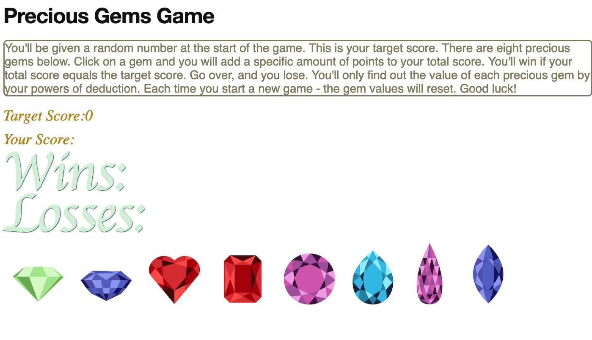

# HW4 - Precious Gems Game

## Technologies Used
* Javascript
* jQuery
* HTML
* CSS
* Animate.CSS
* Bootstrap V4

## Comments
* known bug in jQuery preventing gemValues from updating after reset (fixed in v2)
* reset() updates .gem-image.attr "data-gemvalue" FINALLY FIXED!!!
* utilized arrays to dynamically generate random values for gem values 
* utilize JS ES6 syntax
* reset() function resets score, gemValues array, targetScore
* added Counter
* added edge case for #gem7

## Screenshot

